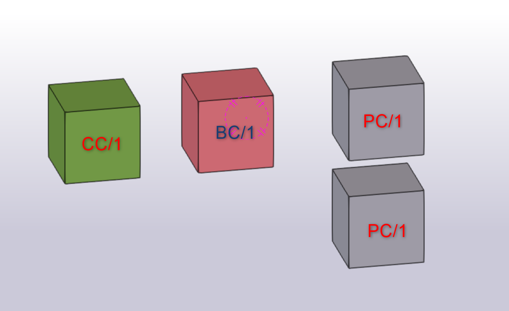

# IFC CUBE

To use project clone or download it from github, navigate to folder and install necessary packages with command:
```
pip install -r requirements.txt
```

When packages are installed you can run projects with command:
```
streamlit run app.py
```
## Features

* count unique detailes in column
* compare two columns

---

## Testing

In examples folder you can find "IFC_4_CUBES.ifc" file, you can drag and drop it in project to see default behavior.

"IFC_4_CUBES.ifc" file has 4 cubes in it


---

## Additional

You can add column and row names which always should be ignored for more cleaner view (in folder "configs" there is detailed instructions)

---